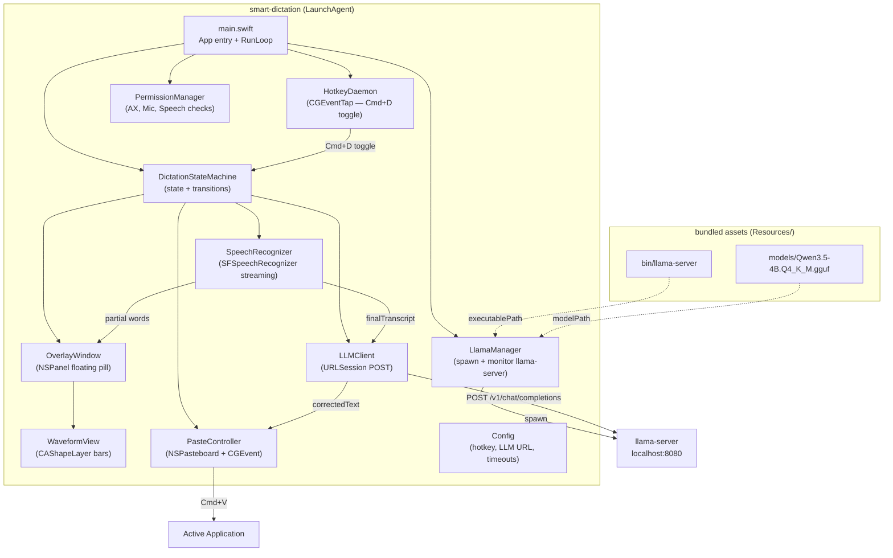
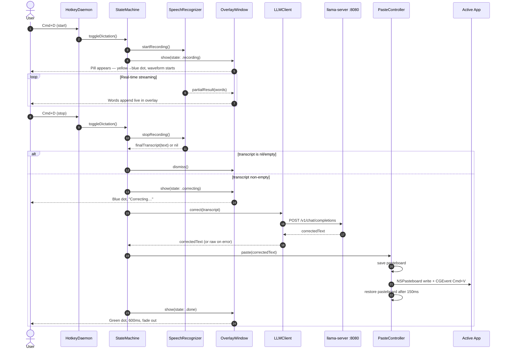
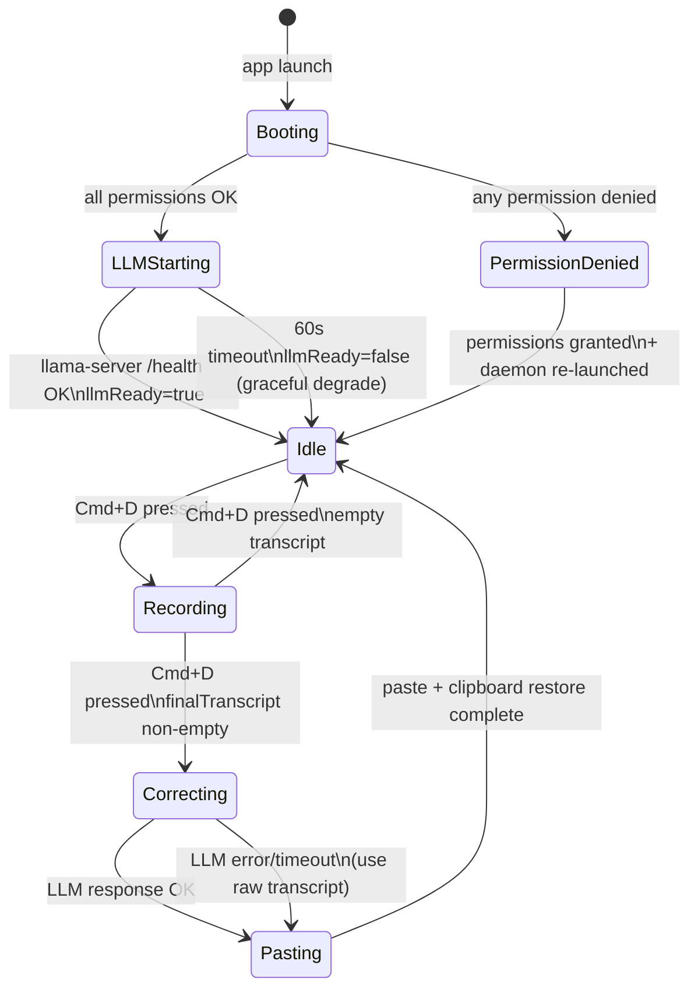

# Architecture: Smart Dictation

Date: 2026-04-22
Author: Pravin Gayal
Status: Under Review

---

## 1. Context

macOS built-in dictation mis-transcribes words heavily for non-native English accents (specifically Indian-accented English). The goal is a fully local daemon that:

1. Streams real-time transcription (SFSpeechRecognizer) exactly like macOS dictation — words appear as spoken
2. When dictation ends, runs one LLM pass to fix spelling/grammar artifacts caused by accent mis-recognition
3. Pastes the corrected result into whatever app is focused

Everything runs on-device. The project is fully self-contained — it manages its own llama-server and model, independent of any other project.

---

## 2. Requirements

### Functional

| # | Requirement |
|---|-------------|
| F1 | Press `Cmd+D` to start dictation; press `Cmd+D` again to stop (toggle, not hold-to-record) |
| F2 | Display a compact floating overlay (Superwhisper-style pill) showing: animated audio waveform, live transcription words, status dot (yellow=starting, blue=recording, green=done) |
| F3 | While recording, stream partial transcription words live into the overlay |
| F4 | On stop: send the full final transcript to local LLM for accent/grammar correction (~1–2s) |
| F5 | Paste the corrected text into the currently focused application |
| F6 | Auto-start at login via a LaunchAgent plist |
| F7 | Self-contained: manage own llama-server process and model — no dependency on any other project |

### Non-Functional

| # | Requirement |
|---|-------------|
| N1 | Zero network calls except to `localhost:8080` |
| N2 | LLM correction latency: ≤2 seconds for typical dictation (50–200 words) |
| N3 | Overlay floats above all windows including full-screen apps |
| N4 | macOS 13+ deployment target (Apple Silicon primary) |
| N5 | All permissions requested lazily with user-visible guidance on denial |
| N6 | llama-server started and monitored by the daemon itself at launch |

### Constraints

- Single Swift Package Manager project — no Node, no TypeScript, no Electron
- Project root: `/Users/pravingayal/VibrentHealth/Playground/Workspace/smart-dictation`
- Model and binary bundled inside the project — self-contained
- LLM call is non-streaming URLSession POST to `/v1/chat/completions`

---

## 3. System Design

### 3.1 Component Diagram



### 3.2 Sequence Diagram — Full Dictation Flow



### 3.3 Daemon State Machine



---

## 4. Overlay UI Design (Superwhisper-style)

### 4.1 Visual Specification

```
╭──────────────────────────────────────────────╮
│  ●  ▁▃▅▃▁  words appear here as you speak…   │
╰──────────────────────────────────────────────╯
```

| Element | Specification |
|---------|---------------|
| Shape | Rounded rectangle pill — ~380×56pt, corner radius 28pt |
| Position | Bottom-center of `NSScreen.main`, 32pt above Dock |
| Background | Dark translucent: `NSColor.black.withAlphaComponent(0.82)` + `NSVisualEffectView` vibrancy |
| Status dot | 10pt circle: yellow `#F5C842` = starting, blue `#4A9EFF` = recording, green `#4CD964` = done |
| Waveform | 5 `CAShapeLayer` bars, heights driven by `AVAudioEngine` RMS power, animated at 10fps |
| Text label | `NSTextField`, SF Pro 13pt, white, shows streaming partial words |
| Window level | `.floating` + `collectionBehavior = [.canJoinAllSpaces, .fullScreenAuxiliary]` |
| Focus behavior | `NSPanel.becomesKeyOnlyIfNeeded = true` — never steals keyboard focus |

### 4.2 State Visuals

| State | Dot | Waveform | Label |
|-------|-----|----------|-------|
| `.recording` | Blue, pulsing | Animated bars | Streaming words |
| `.correcting` | Blue, static | Static | *"Correcting…"* italic |
| `.done` | Green | Hidden | Final corrected text (600ms) |
| `.llmOffline` | Orange | Hidden | *"LLM offline — raw text"* |

---

## 5. Hotkey Design — Cmd+D Toggle

### 5.1 CGEventTap Configuration

- **Tap type:** `.cgSessionEventTap`
- **Event mask:** `keyDown` only
- **Filter:** `keyCode == kVK_ANSI_D && flags.intersection(.maskCommand) == .maskCommand && flags.intersection([.maskShift, .maskOption, .maskControl]) == []`
- **Action:** call `stateMachine.toggleDictation()`
- **Consume:** `YES` — Cmd+D does not reach the active app while tap is active

### 5.2 Non-Hotkey Events

All non-matching events are returned immediately from the callback without inspection, storage, or logging. This is a **security invariant** enforced at code review — the daemon is not a keylogger.

### 5.3 Known Conflict

`Cmd+D` is used by Finder (duplicate) and Safari (bookmark). These shortcuts stop working while smart-dictation is running. If this is disruptive in practice, change `Config.hotkeyCode` to `kVK_ANSI_D` with `.maskCommand | .maskShift` (`Cmd+Shift+D`) — documented in README.

---

## 6. Self-Contained LLM Setup (LlamaManager)

| Attribute | Value |
|-----------|-------|
| Binary path | `<executableDir>/Resources/bin/llama-server` |
| Model path | `<executableDir>/Resources/models/Qwen3.5-4B.Q4_K_M.gguf` |
| Launch args | `--model <path> --host 127.0.0.1 --port 8080 --ctx-size 4096 --n-gpu-layers 99 --flash-attn on --parallel 1` |
| Health check | `GET /health` every 500ms up to 60s at startup |
| Startup overlay | Show "LLM warming up…" in overlay state until health OK |
| On crash | Restart once automatically; second crash within 30s → `llmReady=false`, log |
| On daemon exit | `process.terminate()` in `deinit` — child process always cleaned up |
| Model name for requests | Read from `Config.llmModel` (default `"qwen3.5-4b"`), overridable via `LLM_MODEL` env var |

---

## 7. Integration Points

### 7.1 SFSpeechRecognizer

| Attribute | Value |
|-----------|-------|
| Mode | `SFSpeechAudioBufferRecognitionRequest` — audio buffers fed from `AVAudioEngine` input tap |
| On-device | `request.requiresOnDeviceRecognition = true` |
| Partial results | `result.isFinal == false` → append words to overlay |
| Final result | `result.isFinal == true` → deliver to state machine; `nil` if empty/whitespace |
| Prerequisite | On-device model requires macOS Dictation to have been enabled once. `setup.sh` checks and guides user. |

### 7.2 LLM Correction

| Attribute | Value |
|-----------|-------|
| Endpoint | `POST http://localhost:8080/v1/chat/completions` |
| Body | `{model, messages:[system+user], temperature:0.1, max_tokens:512, stream:false}` |
| Success | `choices[0].message.content` → paste |
| Offline/error | Use raw transcript → paste, show `.llmOffline` overlay state |
| Timeout | 10 seconds (`URLRequest.timeoutInterval`) |

### 7.3 Paste Controller

1. Save `NSPasteboard.general` current contents (string + declared type)
2. Write corrected text to pasteboard
3. Post `CGEvent` Cmd+V to HID event stream
4. After 150ms delay: restore saved pasteboard contents

### 7.4 Permissions (all checked at startup)

| Permission | API | On Denial |
|---|---|---|
| Accessibility | `AXIsProcessTrustedWithOptions([kAXTrustedCheckOptionPrompt: true])` | `PermissionDenied` state, notification with path to add |
| Microphone | `AVCaptureDevice.requestAccess(for: .audio)` | `PermissionDenied` state, notification |
| Speech Recognition | `SFSpeechRecognizer.requestAuthorization` | `PermissionDenied` state, notification |

---

## 8. LLM System Prompt

```
You are a speech-to-text post-processor for a speaker with Indian-accented English.
Your job is to fix transcription errors caused by accent mis-recognition while
preserving the speaker's exact meaning and word choices.

Rules:
- Fix phonetically mis-transcribed words using context
  (e.g. "tree" → "three", "wery" → "very", "dis" → "this", "W" → "the").
- Fix grammar, punctuation, and capitalization errors from speech recognition.
- Do NOT rephrase, summarize, add content, or change the speaker's style.
- Output ONLY the corrected text — no preamble, no explanation.
- Preserve technical terms, proper nouns, code identifiers, and URLs exactly.
- If input is a short phrase with no obvious error, output it unchanged.

Input: raw speech-to-text output
Output: corrected text only
```

---

## 9. Project Layout

```
smart-dictation/                   ← parallel to PFA, fully independent
├── Package.swift
├── Sources/
│   └── SmartDictation/
│       ├── main.swift
│       ├── Config.swift
│       ├── DictationStateMachine.swift
│       ├── HotkeyDaemon.swift
│       ├── SpeechRecognizer.swift
│       ├── OverlayWindow.swift
│       ├── WaveformView.swift
│       ├── LLMClient.swift
│       ├── LlamaManager.swift
│       ├── PasteController.swift
│       └── PermissionManager.swift
├── Resources/
│   ├── bin/
│   │   └── llama-server            ← committed (~10MB binary)
│   └── models/
│       └── Qwen3.5-4B.Q4_K_M.gguf ← NOT committed (2.7GB); setup.sh copies it
├── LaunchAgents/
│   └── com.pravingayal.smart-dictation.plist
├── scripts/
│   ├── setup.sh                    ← copies model, installs LaunchAgent, checks permissions
│   └── uninstall.sh
└── .gitignore                      ← ignores Resources/models/*.gguf
```

**Package.swift:**
```swift
// swift-tools-version: 5.9
let package = Package(
    name: "SmartDictation",
    platforms: [.macOS(.v13)],
    targets: [
        .executableTarget(
            name: "SmartDictation",
            path: "Sources/SmartDictation"
            // Resources accessed via Bundle.module or relative to executable path
        )
    ]
)
// No third-party dependencies — AVFoundation, Speech, AppKit, CoreGraphics are system frameworks
```

---

## 10. LaunchAgent Plist

```xml
<?xml version="1.0" encoding="UTF-8"?>
<!DOCTYPE plist PUBLIC "-//Apple//DTD PLIST 1.0//EN"
  "http://www.apple.com/DTDs/PropertyList-1.0.dtd">
<plist version="1.0">
<dict>
    <key>Label</key>
    <string>com.pravingayal.smart-dictation</string>
    <key>ProgramArguments</key>
    <array>
        <string>/Users/pravingayal/VibrentHealth/Playground/Workspace/smart-dictation/.build/release/SmartDictation</string>
    </array>
    <key>RunAtLoad</key>
    <true/>
    <key>KeepAlive</key>
    <dict>
        <key>SuccessfulExit</key>
        <false/>
    </dict>
    <key>StandardOutPath</key>
    <string>/Users/pravingayal/Library/Logs/smart-dictation/daemon.log</string>
    <key>StandardErrorPath</key>
    <string>/Users/pravingayal/Library/Logs/smart-dictation/daemon.error.log</string>
    <key>EnvironmentVariables</key>
    <dict>
        <key>LLM_BASE_URL</key>
        <string>http://localhost:8080</string>
        <key>LLM_MODEL</key>
        <string>qwen3.5-4b</string>
    </dict>
</dict>
</plist>
```

---

## 11. Testing Approach

### Unit Tests

| Component | What to test |
|-----------|-------------|
| `DictationStateMachine` | All valid transitions; invalid transitions are no-ops; error recovery paths |
| `LLMClient` | JSON encoding/decoding; 10s timeout via URLProtocol mock; offline → raw transcript fallback |
| `PasteController` | Save/write/restore pasteboard sequence; 150ms timing |
| `LlamaManager` | Correct spawn args; health retry logic; single auto-restart on crash |
| `Config` | Defaults; `LLM_BASE_URL`/`LLM_MODEL` env var overrides |

### Manual Acceptance Tests

| Scenario | Pass Criteria |
|----------|---------------|
| Cmd+D → overlay appears | Visible within 100ms, yellow→blue dot |
| Speak 5 words | Each word appears within 500ms of being spoken |
| Cmd+D stop → paste | Corrected text pasted within 2s, green flash, overlay dismisses |
| Indian accent phonetics | "tree" → "three", "wery" → "very" corrected by LLM |
| llama-server offline | Raw transcript pasted, orange "LLM offline" shown, no crash |
| Empty dictation | No paste, overlay dismisses |
| Clipboard preserved | Item copied before dictating is restored after paste |
| Deny microphone | Notification, no crash, daemon alive |

---

## 12. Key Decisions

| # | Chose | Rejected | Reason |
|---|---|---|---|
| D1 | SFSpeechRecognizer | whisper.cpp | Native streaming partial results; no C++ bridging |
| D2 | Cmd+D toggle | Hold-to-record | Comfortable for long dictations; user's explicit requirement |
| D3 | Superwhisper-style pill overlay | Plain text window | Waveform gives recording confidence; status dot communicates state |
| D4 | LlamaManager spawns llama-server | Piggyback on PFA | Self-contained; no cross-project dependency |
| D5 | NSPasteboard + CGEvent Cmd+V | AXUIElement | Universal across all apps including Electron |
| D6 | Copy model/binary into project | Symlink from PFA | Self-contained; no breakage if PFA moves or is deleted |
| D7 | Accent-aware LLM prompt | Generic grammar fix | Solves actual pain point — Indian English phonetic substitutions |

---

## 13. Out of Scope

- Multi-language support (English only)
- Custom hotkey configuration UI
- Menu bar icon or preferences window
- Streaming LLM correction (non-streaming sufficient)
- Replacement of macOS system dictation
- Universal binary (ARM64 only)
- Cloud LLM fallback

---

## 14. Open Questions

### OQ1: Cmd+D conflict in Finder/Safari
`Cmd+D` is consumed by the daemon, breaking Finder duplicate and Safari bookmark shortcuts. Test in practice — if disruptive, change to `Cmd+Shift+D` in `Config.swift`. No blocker.

### OQ2: On-device speech model prerequisite
User must have enabled macOS Dictation at least once to trigger the on-device model download. `setup.sh` will check and print instructions if not available. No blocker.
